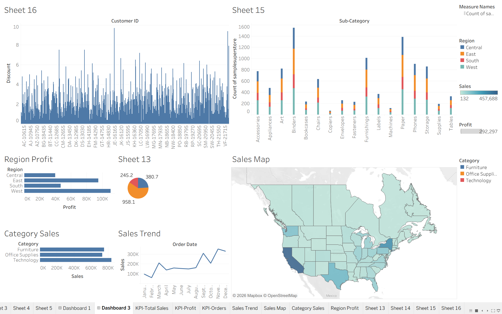

# 📊 Sales & Business Analytics Dashboard

## 📌 Project Overview

This project presents an **interactive Sales & Business Analytics Dashboard** developed using **Tableau**. The dashboard transforms sales transaction data into meaningful visual insights to understand business performance across different **regions, categories, sub-categories, customers, sales trends, and profitability**.

The project demonstrates how data visualization and business analytics can be used to identify patterns, compare performance, and support data-driven decision-making.

---

## 🎯 Objectives

* Analyze overall sales and profit performance.
* Track sales trends over time.
* Compare performance across different regions.
* Analyze sales by product category and sub-category.
* Identify regional profit differences.
* Visualize geographic sales performance using maps.
* Provide interactive KPIs for quick business insights.
* Create an easy-to-understand business intelligence dashboard.

---

## 🛠️ Tools & Technologies

* **Tableau** – Data visualization and dashboard development
* **Microsoft Excel / CSV** – Dataset and data preparation
* **Data Analytics** – Business performance analysis
* **Data Visualization** – Charts, maps, KPIs, and interactive dashboards

---

## 📊 Dashboard Features

### 🔹 KPI Analysis

The dashboard includes dedicated KPI views for monitoring:

* **Total Sales**
* **Total Profit**
* **Total Orders**

These KPIs provide a quick overview of the organization's overall performance.

### 🔹 Sales Trend Analysis

The **Sales Trend** visualization shows how sales change over different months, helping identify:

* Growth patterns
* High-performing periods
* Low-performing periods
* Seasonal variations

### 🔹 Category Sales

The dashboard compares sales across major product categories:

* Furniture
* Office Supplies
* Technology

This helps identify which product categories contribute the most to total sales.

### 🔹 Region Profit Analysis

The **Region Profit** chart compares profitability across:

* Central
* East
* South
* West

This allows users to identify the strongest and weakest-performing regions.

### 🔹 Sub-Category Analysis

The dashboard provides a detailed comparison of product sub-categories such as:

* Accessories
* Appliances
* Art
* Binders
* Chairs
* Copiers
* Envelopes
* Machines
* Paper
* Phones
* Storage
* Tables
* and more

Regional distribution is also represented within the visualization.

### 🔹 Sales Map

The interactive **Sales Map** displays geographic sales performance across the United States.

The map provides insights based on product categories:

* Furniture
* Office Supplies
* Technology

This makes it easier to understand geographic patterns in sales.

### 🔹 Customer-Level Analysis

The dashboard also includes customer-level visualization to analyze discount and customer-related sales information.

---

## 📈 Key Visualizations

The project contains multiple Tableau worksheets and dashboards, including:

* KPI – Total Sales
* KPI – Profit
* KPI – Orders
* Sales Trend
* Sales Map
* Category Sales
* Region Profit
* Sub-Category Analysis
* Customer Analysis
* Additional supporting visualizations

---

## 🖥️ Dashboard Preview



> **Note:** Upload your dashboard screenshot to the GitHub repository and name it `dashboard.png`, or change the filename above to match your uploaded image.

---

## 🔍 Business Insights

The dashboard can be used to identify:

* Which regions generate the highest profit.
* Which categories contribute the most sales.
* How sales change throughout the year.
* Which sub-categories have stronger performance.
* Geographic differences in sales.
* Relationships between sales, profit, customers, and discounts.
* Areas where business performance can potentially be improved.

---

## 📂 Project Structure

```text
Sales-Business-Analytics-Dashboard/
│
├── Dashboard/
│   └── Sales_Business_Analytics.twbx
│
├── Dataset/
│   └── superstore.csv
│
├── Images/
│   └── dashboard.png
│
└── README.md
```

> Rename the files/folders according to the actual files you upload to GitHub.

---

## 🚀 How to Use

1. Download or clone this repository.
2. Install **Tableau Desktop** or use a compatible Tableau environment.
3. Open the `.twb` or `.twbx` Tableau workbook.
4. Connect the workbook to the provided dataset if required.
5. Open the dashboard.
6. Interact with the charts, filters, maps, and KPIs to explore the data.

---

## 📌 Project Type

**Business Analytics | Data Visualization | Business Intelligence**

---

## 👨‍💻 Author

**Nikhil**

B.E. Artificial Intelligence & Machine Learning

---

## ⭐ Conclusion

This project demonstrates the use of **Tableau for transforming raw business data into interactive and meaningful visualizations**. The dashboard provides a comprehensive view of sales, profit, orders, regional performance, product categories, trends, and geographic distribution, helping users make better data-driven business decisions.

---

⭐ **If you found this project useful, consider giving the repository a star!**
